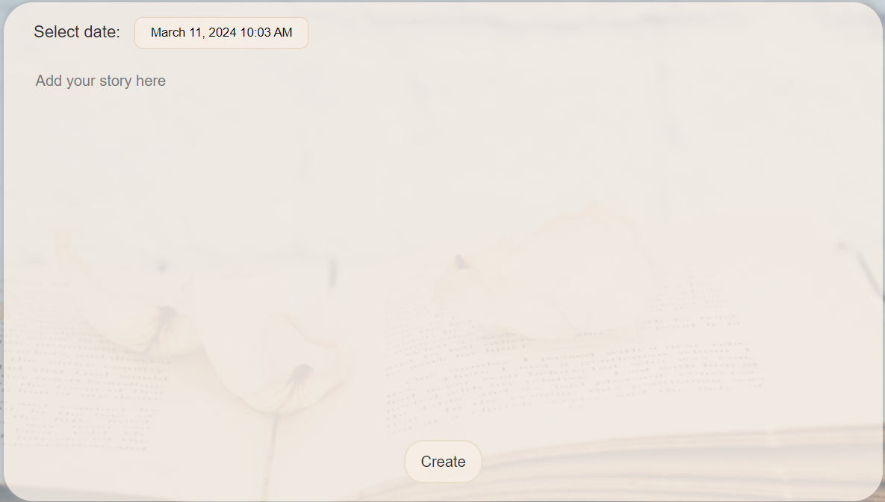

# MY DIARY PROJECT

## APP DESCRIPTION:

My Diary is a user-friendly web application, in which you can effortlessly manage your meetings,
maintain a to-do list, and pour your thoughts and emotions into a digital diary.
Everything is stored in the local storage, so that nothing will be missed.

## KEY FEATURES

Framework and Language:

✅ Frontend Framework: React (created with create-react-app)

✅ Language: TypeScript

✅ Styling: Styled Components

Routing:

✅ React Router.

State Management:

✅ useState: Used to manage local component state.

✅ useEffect: Handles side effects and data fetching.

✅ useReducer: Manages complex state logic.

✅ Context API: Provides global state management.

Local Storage:

✅ All data is stored in localStorage.

Date Management:

✅ React Datepicker.

User Interaction:

✅ Users save their meetings, todo things and diaries for future display.

